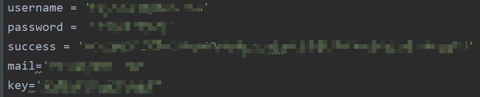

#有道云笔记签到脚本
##简介
#####（仅支持使用网易邮箱登陆的账号）
有道云笔记每天定时自动签到领存储空间的小脚本（Python）。
不需要服务器或者设备，通过 github action 来实现自动签到。
支持Server酱和QQ邮箱通知（其他邮箱亦可，需更改邮箱服务器地址）
##声明
仅供个人研究/学习/欣赏，可参考学习，请勿用于其他用途。
##使用步骤
#### 一、fork 本仓库
点击右上角的 fork。
#### 二、修改发送QQ邮箱
在代码中修改msg_from字符串修改为自己的发送邮箱
#### 三、在添加 secret 添加字段
共添加五个字段如下图所示

依次为邮箱地址、邮箱密码、server酱授权码、收件QQ邮箱、发送邮箱授权码
#### 四、开启**actions**运行脚本
点击开启actions后需要一个**push**操作才会触发actions运行。
将项目中的`poinMe.txt`文件的`flag`值由`0`改为`1`即可

## 大功告成
每天会在8:00进行自动签到。(有时候会延迟10~20分钟)

## 参考项目
[checkin](https://github.com/lepecoder/checkin)
